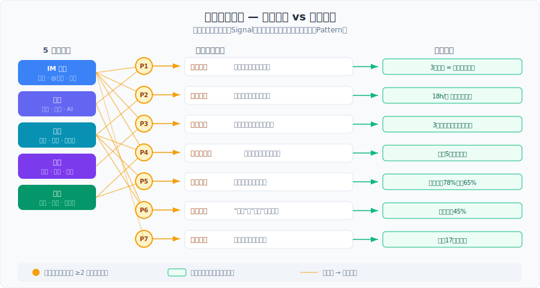
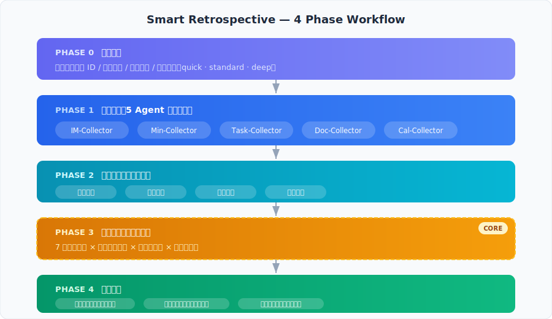
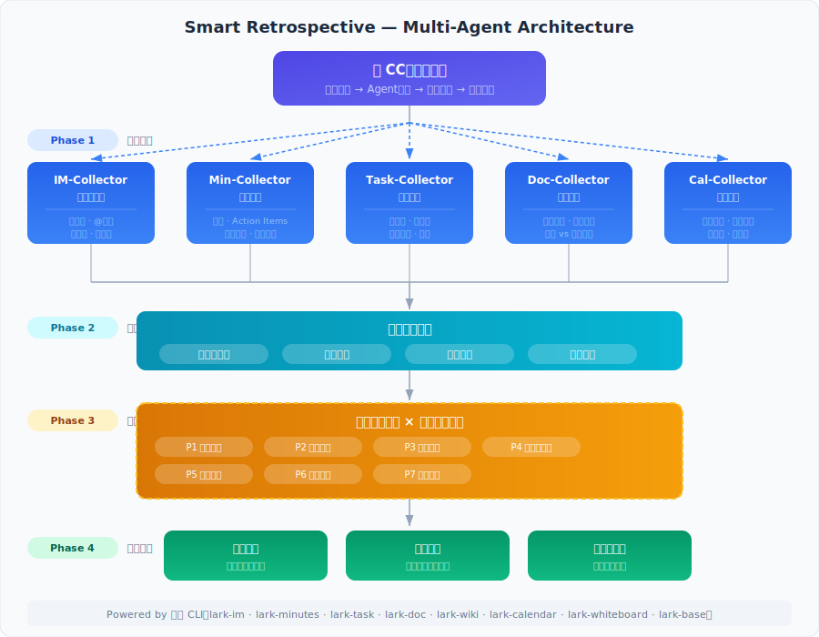

# Smart Retrospective 智能项目复盘

> **核心价值**：从飞书5种数据源（群聊/妙记/任务/文档/日历）中，用多Agent并行采集 + 跨源交叉验证，发现人工复盘看不见的7种协作模式。
>
> **关键创新**：跨源模式检测——单源分析只能看到信号，双源交叉验证才能发现因果链。
>
> **技术栈**：Claude Code + 飞书 CLI | MIT License

---

## 解决什么问题

你们公司的复盘会，大概率是这样的：

周五下午四点半，会议室。"大家聊聊这次项目怎么样？"沉默三秒。张三说了一件他记得的事，李四补充了一个他觉得重要的点，王五说"整体还行"。半小时后写了一页PPT，散会。下个项目，同样的坑再踩一遍。

**根本原因**：人的记忆是有偏差的。

| 偏差类型 | 表现 | 后果 |
|---------|------|------|
| 选择性记忆 | 你记得的 ≠ 实际发生的 | 遗漏关键事件 |
| 归因偏差 | 你以为的原因 ≠ 真正的原因 | 对策无效 |
| 感知盲区 | 你觉得"还行" ≠ 数据上正常 | 问题持续恶化 |

项目的真实历史全部记录在飞书里——群聊、妙记、任务、文档、日历。每一条消息都有时间戳，每一个任务都有状态变更。只是没有人把它们串起来看。

**Smart Retrospective 做的就是这件事：** 派出5个AI Agent并行采集飞书数据，交叉分析，找出人工复盘看不见的跨源模式。

---

## 核心创新：跨源模式检测

### 为什么现有工具不够

市面上的工具都在做**单源分析**——飞书妙记总结会议，任务看板统计进度，群消息做个词云。这些有用，但不够。

单看群聊你只知道"讨论少了"。单看任务你只知道"逾期了"。**只有把两个放一起看，才能发现"讨论少了3天之后任务就逾期了"。**

### 跨源 vs 单源对比

| 单源能看到的 | 跨源才能发现的 | 涉及数据源 |
|-------------|-------------|-----------|
| "群里讨论减少了" | 讨论量下降73% → 5天后3个任务逾期（可提前5天预警） | IM + Task |
| "这个任务逾期了" | 张三是跨3个群的信息枢纽，响应延迟导致下游每周等待18小时 | IM + Task |
| "这周开了很多会" | 会议数+75%，但任务完成率-7%——会议从工具变成负担 | Calendar + Task |
| "会上说了要做X" | 42个承诺 → 28个建了任务 → 19个完成，闭环率仅45% | Minutes + Task |
| "群里有技术讨论" | 5次关键讨论（200+条消息）未产出任何文档，知识随消息流沉没 | IM + Doc |

**这些模式对单个数据源不可见。** 只有同时看消息+任务+会议+文档+日历，才能看到完整因果链。

### 跨源模式检测全景

<p align="center">
  
</p>

---

## 7种检测模式

| # | 模式名称 | 数据源 | 检测目标 | 场景示例 |
|---|---------|--------|---------|---------|
| P1 | **决策漂移** | 妙记+群聊 | 同一议题反复讨论，结论不断翻转 | 3次会议对同一问题做了3个不同决定，团队在原地打转 |
| P2 | **沉默瓶颈** | 群聊+任务 | 某人是隐藏的信息枢纽，拖慢整体进度 | 张三被@频率4倍于均值，响应延迟每周浪费18小时 |
| P3 | **知识蒸发** | 群聊+文档 | 重要讨论未文档化，知识随消息流沉没 | 4人讨论2小时数据库选型，没人写文档，3周后重新讨论 |
| P4 | **危机前静默** | 群聊+任务+日历 | 沟通频率异常下降预示即将到来的问题 | 消息量连降3天后，3个关键任务逾期+紧急会议 |
| P5 | **会议通胀** | 日历+任务 | 会议增加但产出不增，协调开销失控 | 每周4会→9会，完成率从78%降到65% |
| P6 | **承诺衰减** | 妙记+任务 | 从"说了"到"做了"每一步都在丢失 | 42个action items只有19个按时完成，闭环率45% |
| P7 | **信息孤岛** | 多群聊 | 不同团队讨论同一话题但结论不同 | 前端群排5月1号，后端群排5月15号，没人互相通知 |

**验证标准**：每个模式必须有 ≥2个独立数据源的证据交叉验证。单源异常仅标记为"信号"，不升级为"模式"。

---

## 工作原理

### 4阶段流程

<p align="center">
  
</p>

### 架构图

<p align="center">
  
</p>

### 为什么用多Agent并行

5个数据源串行采集需要约25分钟。并行采集后降到约5分钟。每个Agent只负责一种数据源，专注度高，输出格式统一，便于Phase 2/3的标准化处理。

---

## 具体能发现什么：6个真实场景

### 场景1：会上说了但没人做

你们开了8次会，提了42个"我来做"。它去查飞书任务，发现只有28个建了任务，最终按时完成的只有19个。**闭环率45%**。最大的坑不是"做不完"，是"说完就忘了建任务"。

### 场景2：有个人是隐形瓶颈

张三在3个群里被@的频率是别人的4倍。他平均6.5小时才回复，每次他回复之后下游任务才能启动。一周下来，整个团队因为等他回复累计浪费了18小时——但没有人意识到这件事。

### 场景3：重要讨论沉在群聊里

4月5号，4个人在群里讨论了2小时的数据库选型，发了38条消息。没人把结论写成文档。4月22号新同事问了同样的问题，只有2个人能回答，而且记忆不一致。

### 场景4：出事之前有预兆

4月10号到13号，群消息量从每天45条突然掉到12条。4月16号，3个关键任务逾期，紧接着开了一个紧急会议。那3天的沉默就是预警信号——如果当时检测到消息量异常下降，可以提前5天介入。

### 场景5：会越开越多，活越干越少

3月份每周4个会，任务完成率78%。4月底变成每周9个会，完成率反而掉到65%。会议占了45%的工作时间，从工具变成了负担。

### 场景6：两个群结论不一样

前端群决定"按5月1号排期"，后端群说"推迟到5月15号"。没人互相通知。前端白干了17天。

---

## 快速开始

### 前置条件

1. 安装 [飞书 CLI](https://github.com/nicepkg/feishu-cli) 并完成授权
2. 安装 [Claude Code](https://docs.anthropic.com/en/docs/claude-code)
3. 将本 skill 安装到 Claude Code skills 目录

### 安装

```bash
cd ~/.claude/skills
git clone https://github.com/Evan-miwillbe/smart-retrospective.git
```

### 使用

在 Claude Code 中输入：

```
/smart-retrospective

项目：Q2产品迭代
群ID：oc_xxxxxxxxx, oc_yyyyyyyyy
时间：2026-03-01 ~ 2026-04-30
输出：~/Desktop/retro-q2
```

### 分析深度

| 模式 | 时间 | 场景 |
|------|------|------|
| `depth: quick` | ~15分钟 | 快速健康检查（仅消息+任务） |
| `depth: standard` | ~45分钟 | 标准复盘（全5源+全7模式） |
| `depth: deep` | ~90分钟 | 重大项目/事故复盘（深度采集+交叉验证） |

---

## 示例输出

以下是一份模拟复盘报告的核心部分：

> **Q2产品迭代 智能复盘报告**
>
> 复盘范围：2026-03-01 ~ 04-30 | 2群 + 6妙记 + 32任务 + 15文档 + 20日历
>
> **核心发现**
> 1. **承诺衰减严重**：会议承诺闭环率仅45%，最大丢失在"说了但没建任务"环节
> 2. **沉默瓶颈**：@张三 是跨群信息枢纽，其响应延迟每周造成约18小时下游等待
> 3. **知识蒸发**：5次关键技术讨论（共200+条消息）未产出任何文档
>
> **关键建议**
> 1. 每次会议结束5分钟内，由主持人创建飞书任务（预期提升闭环率至70%+）
> 2. 给张三设立backup联系人，分散信息枢纽压力
> 3. 技术讨论超过20条消息时，自动提醒创建文档（可通过飞书机器人实现）

每条发现都附带完整证据链——具体哪条消息、哪个任务、哪次会议，时间戳+来源标注，点进去就能看到原始数据。

### 模式优先级排序

检测到多个模式时，按以下维度加权排序：

| 维度 | 权重 | 说明 |
|------|------|------|
| 影响范围 | 30% | 影响多少人/多少任务 |
| 时间成本 | 30% | 估算浪费的人·天 |
| 可改善性 | 25% | 改进建议的可执行度 |
| 置信度 | 15% | 证据链的强度 |

**总分 = 各维度分数 × 权重**，按降序排列。高优先级模式排在报告最前面。

---

## 设计原则

| 原则 | 含义 | 为什么这样设计 |
|------|------|-------------|
| **跨源才是模式** | 单源发现只是信号，双源交叉验证才升级为模式 | 避免误报，提高发现的可信度 |
| **证据链不可断** | 每个发现可追溯到具体消息/任务/会议（时间戳+来源） | 让读者能自行验证，不盲信AI结论 |
| **量化 > 定性** | "响应时间从2h增至8h" > "沟通效率下降了" | 量化才能比较，比较才能改进 |
| **归因不归咎** | 指向系统问题，不指向个人责任 | 复盘不是甩锅大会，归咎会让人不愿暴露问题 |
| **数据不足则降级** | 某源无数据不阻塞，标注后继续分析 | 不因缺数据而停摆，标注后人工判断 |

---

## 与现有工具对比

| 能力 | 飞书妙记 | 飞书任务看板 | 人工复盘会 | **Smart Retrospective** |
|------|---------|------------|----------|----------------------|
| 消息分析 | - | - | 靠回忆 | **自动采集+结构化** |
| 任务追踪 | - | 有 | 靠回忆 | **自动采集+趋势分析** |
| 会议记录 | 有 | - | 靠回忆 | **自动采集+承诺追踪** |
| 文档分析 | - | - | - | **自动采集+蒸发检测** |
| 日历分析 | - | - | - | **自动采集+通胀检测** |
| **跨源因果发现** | **不能** | **不能** | **不能** | **7种跨源模式检测** |

**差异化总结**：现有工具各自做好了单源分析。Smart Retrospective 做的是把5个数据源串起来，发现藏在数据源之间缝隙里的问题。

---

## 需求验证

这不是一个假想需求。以下数据来自公开平台的真实用户反馈。

### 行业数据

| 指标 | 数据 | 来源 |
|------|------|------|
| 会议action items完成率 | 仅 **27%** | PMI 社区调研 |
| 开发者因知识孤岛受阻频率 | **45%** 每周≥3次 | StackOverflow 2024 |
| 企业复盘会无效率 | **80%** | 知乎专栏（1.6万阅读） |
| 会议决策执行前蒸发率 | **38%** | 飞书妙记内部数据 |
| 中国企业信息孤岛困扰率 | **90%** | 知乎行业分析 |
| 企业年均知识孤岛损失 | **$47M** | CIO Dive |
| 连续复盘提出同一问题次数 | **5次，零改变** | GoRetro |

### 真实用户声音

> "80%的复盘会都是无效劳动，不是邀功仪式就是甩锅大会。"——知乎

> "没有结果的会议是白开，没有跟踪的会议是多开。"——知乎

> "IM工具和会议都不是好的协同工具，因为无法把信息做到真正的结构化。"——左耳朵耗子（CoolShell）

> "I've repeated the same retrospective items sprint over sprint without them being addressed."——Hacker News

> "Post-mortem lessons end up in a document that sits in some knowledge repo and is hardly ever read."——Scrum Alliance

---

## 飞书 CLI 能力使用

| 模块 | 用途 | 对应Phase |
|------|------|----------|
| `lark-im` | 读取群消息历史、发送报告通知 | Phase 1 采集 + Phase 4 通知 |
| `lark-minutes` | 读取妙记/会议记录 | Phase 1 采集 |
| `lark-task` | 读取任务状态和时间线 | Phase 1 采集 |
| `lark-doc` / `lark-wiki` | 读取文档信息、创建复盘报告 | Phase 1 采集 + Phase 4 输出 |
| `lark-calendar` | 读取会议日程、参与者 | Phase 1 采集 |
| `lark-whiteboard` | 创建项目时间线可视化 | Phase 4 输出 |
| `lark-base` | 存储指标数据到多维表 | Phase 4 输出 |

---

## 技术栈

| 组件 | 选型 | 理由 |
|------|------|------|
| 运行环境 | Claude Code (Opus/Sonnet) | Multi-Agent调度 + 自然语言分析 |
| 数据采集 | 飞书 CLI | 统一的飞书数据访问层，5源并行 |
| 分析方法 | 跨源交叉验证 + 统计模式检测 | 双源验证避免误报，统计阈值(>30%)过滤噪音 |
| 输出格式 | 飞书文档 + 白板 + 多维表 | 报告直接在飞书内查看，无需切换工具 |

---

## 路线图

- [x] v1.0: 4 Phase + 7 Pattern + Multi-Agent 并行采集
- [ ] v1.1: 定期自动巡检模式（schedule + 趋势对比）
- [ ] v1.2: 团队级聚合分析（跨项目对比）
- [ ] v2.0: 自迭代优化检测规则（根据用户反馈调整模式权重）

---

## 参考资料与来源

### 行业研究
- [PMI: 73% of meeting action items go unfinished](https://www.projectmanagement.com/) — PMI Community Survey
- [StackOverflow 2024 Developer Survey: Knowledge Silos](https://survey.stackoverflow.co/2024/) — 45% of devs impacted 3+ times/week
- [CIO Dive: Companies lose $47M/year to poor knowledge sharing](https://www.ciodive.com/)
- [Ponemon Institute: Average unplanned outage costs $9,000/minute](https://www.ponemon.org/)
- [PagerDuty 2024: Customer-impacting incidents up 43% YoY](https://www.pagerduty.com/)

### 中文平台讨论
- [知乎：80%公司都不会复盘](https://zhuanlan.zhihu.com/p/629720809)
- [知乎：你的项目复盘会，为什么开不好？](https://zhuanlan.zhihu.com/p/1976973852446844258)
- [知乎：为什么我们的会议开得多却没产出](https://zhuanlan.zhihu.com/p/1961170631522521882)
- [知乎：90%的中国企业受困于信息孤岛](https://zhuanlan.zhihu.com/p/166543943)
- [知乎：跨部门协同的五个障碍](https://zhuanlan.zhihu.com/p/375152039)
- [V2EX：连续加班一个多月后的反思（159回复）](https://www.v2ex.com/t/927862)
- [V2EX：每天早会制度讨论（43回复）](https://hk.v2ex.com/t/980106)
- [V2EX：求推荐公司用的知识库系统（73回复）](https://v2ex.com/t/914777)
- [CoolShell：聊聊团队协同和协同工具](https://coolshell.cn/articles/22298.html) — 左耳朵耗子
- [CSDN：企业知识库的三大痛点](https://blog.csdn.net/yufeishuju/article/details/150587846)

### 英文社区讨论
- [Hacker News: Retrospectives as box-ticking exercises](https://news.ycombinator.com/item?id=28352828)
- [Hacker News: Why aren't retrospectives a thing in traditional industries?](https://news.ycombinator.com/item?id=17063246)
- [GoRetro: Same issue raised 5 retros in a row with zero change](https://www.goretro.ai/)
- [Scrum Alliance: Why post-mortems fail](https://www.scrumalliance.org/)
- [Easy Agile: Retro action item completion rate 40-50%](https://www.easyagile.com/)

---

## License

MIT

---

## 致谢

本项目参加 [飞书 CLI 创作者大赛](https://bytedance.larkoffice.com/docx/HWgKdWfeSoDw36xu7EYctBrUnsg)，感谢飞书团队和 Way to AGI 社区。

Built with [Claude Code](https://claude.ai/claude-code) + [飞书 CLI](https://github.com/nicepkg/feishu-cli)
